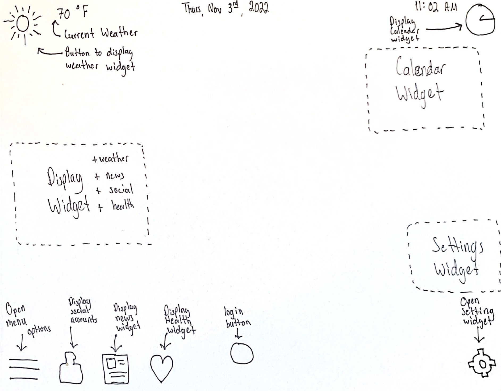
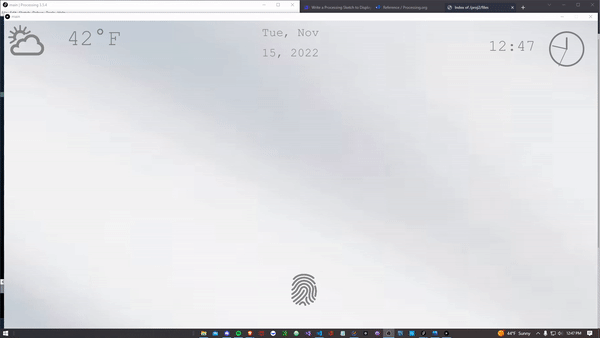
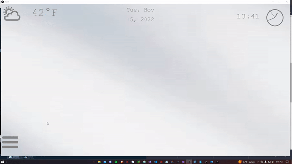
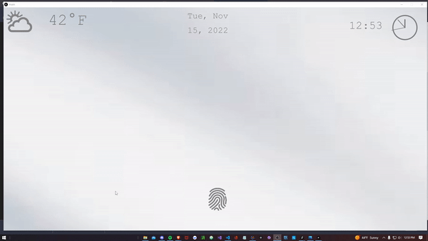
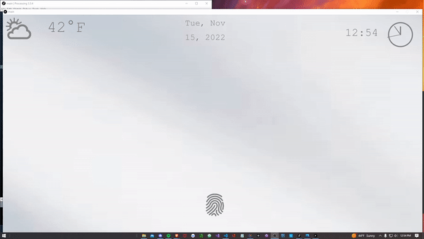
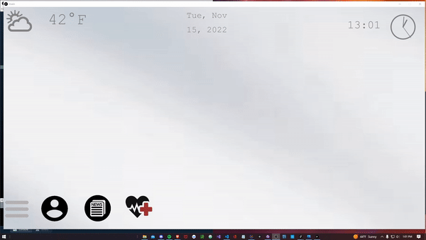
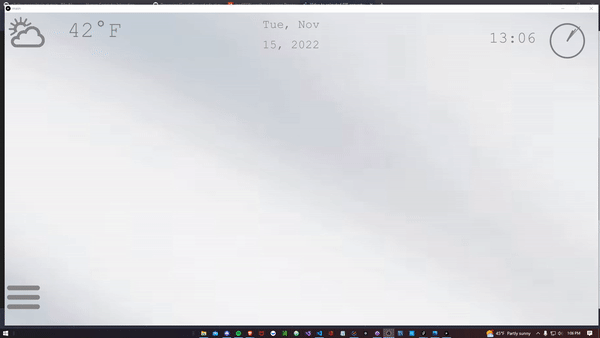
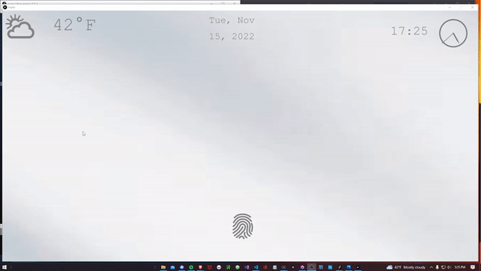

<h1><strong>Part C:</strong></h1>
 

<h3>Sketch</h3>  

    

    My sketch above includes various interactive features that I will explain in more depth below. I choose this design due to the clarity of the user's relfection
    in the mirror and accessibility of the features offered to the user which include the following.

    First we will start with the weather icon and tempature display. If you tap on the weather icon it will bring up a previously not displayed widget
    showing the current weather of that location. This widget can only be opened or shown if the menu icon is closed. This restricts the user to be able 
    to clutter the screen and have difficulty nagivating the interface. Another small feature is that you can switch between farienheit and celcuis by
    touching where the current tempature is displayed.

    Secondly, we have the time display and the clock icon in the top right corner of the interface. The time label displays the current time. Where as if
    you touch the clock icon, a calendar will appear circling the current date.

    Third, located in the bottom right hand of the screen we have a settings icon. If the user touches this icon, a new settings widget will appear in the
    middle right of the interface allowing the user to set a lock time, choose what socials they wish to appear, and change what news station they would
    like to be informed by.

    Lastly, we have a nested functionailty. The menu Icon will  bring up 4 different icons to the right of it, where the menu icon is located in the bottom
    left corner and stationary. When the menu is opened, the weather widget will disappear as previously explained. The four new icons that will be shown
    are to represent {Socials, News, Health, Messages}. The socials will show the user selected social platforms they would like to use such as Reddit, 
    Facebook, or Instagram. From there they will be able to select one of those and a new widget where the weather widget is located (middle left) and the
    user will then be able to access their social account. The same concept and widget placement follows for News. Next, when the user touches the Health
    icon a widget will appear in the same place as the last and show the users total steps, weight, and time slept for that current day and the past day.
    For the text messages, the widget will be in the middle left of the screen and allow the user to access their text messages in real time.

    The logic for all of these features on their icons follow as a touch to open, and another to close that widget. Some features are restriced to be opened
    at the same time as previously explained to ensure the user is not able to clutter the screnn.

 

<h1><strong>Part B:</strong></h1>
 

    After implementating the sketch to real life, there were some changes made. To start the news, socials, and weather widgets are now display at the bottom 
    right of the screen to free up some of the left and center out the middle so the user is still able to clearly see themselves. However the health widget is 
    located in the same place once the user requests it to appear. Why I left this widget is when the user is looking at it, there is logic to not allow widgets
    on the right side be open. This way the user is able to have a full body view on the left side of the mirror. My thought process is the user will most likely
    want to evaluate their full body when considering their own health statistics for the current and past day. Something that still needs to be implemeneted is 
    the weather api call. As of now, the weather widget just shows a hard coded image of Lubbocks weather. 

    Another major change is there is no longer a settings button. I was going to implemenet a whole login system, however I replaced this with a fingerprint icon.
    I figure if this mirror was actually brought to life, it was be much easier on the user to just use a finger print scanner rather than traversing throuhg a 
    whole login system on a smart mirrior. The fingerprint scanner is not at all hard to implement in the project so that is why there is just a fingerprint icon
    that shows and you must press to access the screen. I simply see this as a hardware issue rather than software so will approach it as such.

    As for the background, I choose as close as to a mirror effect as possible that way you can tell what the color contrast will be on the actual mirror.
    Another thing i did to make this as realistic as possible is to include the fingerprint scanner. There are $50 or less hardware scanners that are able
    to read in a users fingerprint for comparison. This would be as simple as plugging in the scanner, creating a boolean value, then reading in that boolean
    for permissions access. This is another reason for taking away the settings menu as there is no account information to configure. 

<h1><strong>Part A:</strong></h1>
 

   To start the Part A of the presentation I would like to waklk through the functionaility of my project by the use of gifs.
    The description of each gif will be below the image explaining its functionailty in detail.

<h3>Sign In Function</h3>

    

    Above is the demonstration of the sign in function. You are not able to access important personal information about the user
    until they have used their own fingerprint to sign in. As of now this is on a 10 minute timer to lock the screen if there is 
    no activity during that time. The weather and calander are accessible due to the fact it sells no personal information. If the
    calander was developed to store personal daily tasks, this would not be the case.

 

<h3>Weather App Function</h3>

    

    The weather icon displays a widget of the local weather and forecast. Along side the weather icon is displayed the current tempeture
    in your location. This can be changed between both meterics to have ease of use for whatever metric system the user may use.

 

<h3>Clock & Calander Function</h3>

    

    If the user presses the clock icon it will open a calender formated in the current months dates. The current day will be circled. 
    As for the the actual clock icon, it has an hour, minute, and second hand just like a normal clock that updates every second.
    Another feature of this smart mirror is the current time will be displayed digitaly next to the clock. The last feature of this
    is the current day, month, and year in a string format that is displayed at all times in the top middle of the mirror.

 

<h3>Menu Function</h3>

    

    The menu function can be pressed to see an assortment of the personal platforms and information you are able to browse. As of now this
    menu contains a social account icon, health icon, and a news icon. However the only way you can access these icons is if the user signs
    in via the fingerprint.

 

<h3>Open Menu Function</h3>

    

    Now to go into detail of what functions the menu can provide. First the social account icon only contains the reddit page for now, however
    can hold up to three different social platforms. This logic goes for the remaining of the icons. Next, the news icon will display a fox news
    widget in the bottom right of the screen to avoid cluter and open up the mirror for the user. Lastly, the health icon will show the users
    hours of sleep for the past day, how many steps they took today and the last, and how much they weighed in the past two days.

 

<h1>Logic</h1>

    

    As briefly explained in the sigin function description, a user can not access the menu items unless they have physically used
    the fingerprint hardware to sign into the smart mirror. They are able to user the weather and look at the calender as that 
    does not give away any personal information and should be easily accessed.

 

    

    To remove the possiblity of the user cluttering the smart screen and in turn not being able to navigate the screen I applied
    some spacing logic. In the demostration above, you are not able to access the weather icon and the menu items at the same time.

 

<h1>Full Functionality</h1>

    

