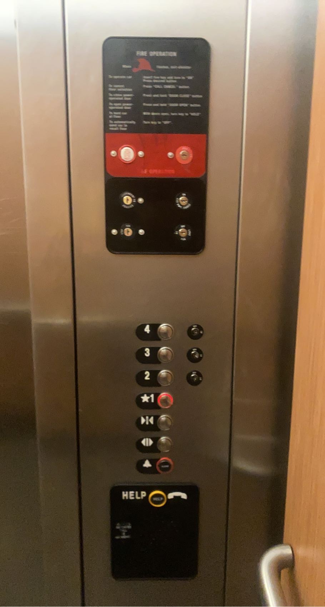
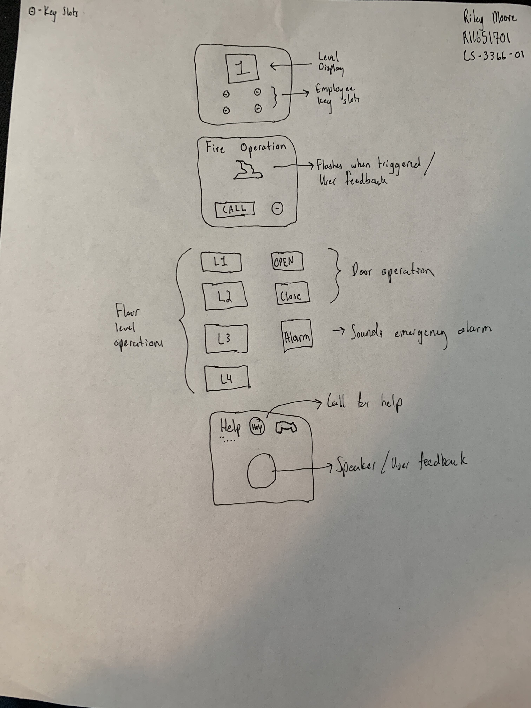
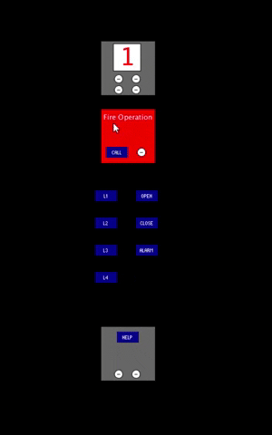

# p1.riley.moore
**Riley Moore**

**Elevator door referenced:** Suites at Overton, East elevator door  

**Sketch**

**Pros:**  
- Help box
- Fire Operations
- Level Display 
 

**Cons:**  
- Button layout
- Employee key slots

**Features:**  
- Open & Close
- Alarm button
- Call feeback
- Fire operation feeback
- Floor level display
- Employee key slots
- Queue for the elevator destination not working properly

The elevator design depicted above is a very common and well-designed door panel. However, there are some flaws to this design. For instance, the help button and red button can be misleading when a user is in panic and needs actual use. I feel that the black box, used to indicate the user needs help, is rather cluttered. A single button and the word “Help” would be sufficient to let the user know the affordance of this button. The key fobs to the right of the floor level buttons could also be misleading as I have no idea what they do myself.

The only people that would ever access these operations would be maintenance workers or an employee of the building by chance they need to use it. Both of these cases imply that they would know what to do as they are employed to do so. For this reason, I am not taking into consideration each operation of each key slot on the door panel. I will just assume the user needs no direction in the use because they will not use it. The measurability buttons I do not think should be on the button of the floor level buttons. In this panel, everything is laid out together and not in consideration of frequency and importance of use for the case of the help buttons. With that said, I would like to split the buttons into the two-column table. The left side controls which level gets put into the queue for the elevator to travel to. While the right side occupies door operations such as close, opening, and sound the alarm in case of an emergency. 

I like how the numbers are ordered from the lowest level on the bottom to the highest level on the top. Therefore, more than likely, that will stay. I think them being side by side with the floor level buttons would be much more appealing, with the measurability buttons being on the right side for the person closest to the panel to be controlling. Also, this way anyone coming onto the elevator has the floor level buttons closest to them to press. I do like how the fire button is at the top of the panel, out of reach from kids. This design promises a statement that it will only be used in case of needs, no accidental pressing by curious children. For the same reason, I do like where the help button is. This may cause some accidental pressing but a call associate is better to be called than the fire department.

The reason I spoke of earlier is that kids are able to press the help button with rather easy accessibility. More than likely, this will stay where it is. However, I do have to consider the case of when a child is alone and needs to signal for help. This is why I am keeping the help button on the bottom of the panel. This way the fire operations can not be signaled for the fire team to come to that local which is very expensive for the company that is using the service. Instead, children will be able to call for help which in turn can call the fire department. Along with the fact that if a child is alone in panic, it is wise to have an adult there to talk them through that traumatic time.

**Elevator Design:**

You are able to find my code for this project in the "src" folder.
